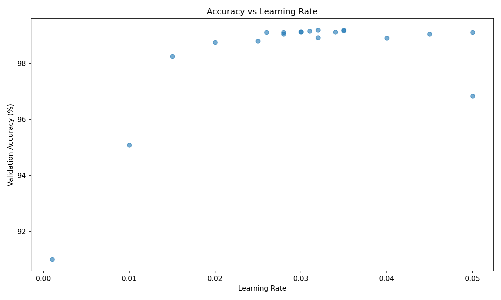

# evolutionary-mnist

This repository demonstrates a simple automated hyperparameter tuning via LLM for a two layer CNN on the MNIST dataset.

Uses:
- [PyTorch](https://pytorch.org/) for training the model
- [OpenRouter](https://openrouter.ai/) for LLM API calls

Future work:
- Improve system prompt.
- Neural Architecture Search for on-the-fly architecture modifications.
- Keep training time constant per run within each generation.

## Example run


Reminder: no regression is used here. The improvements learned come strictly from the LLM's reasoning and analysis on the previous runs.



Example LLM reasoning (which leaves a lot of room for improvement):


## Setup

```bash
uv sync
```

The MNIST dataset is downloaded from Hugging Face: https://huggingface.co/datasets/ylecun/mnist

```bash
uvx --from huggingface_hub hf download ylecun/mnist --repo-type dataset --local-dir data
```

Use the `scripts/prepare_data.py` script to split the dataset into train and validation sets.

## Running Experiments

This example runs for 5 generations with 4 training runs per generation.

```bash
uv run evolutionary-mnist experiments/evo-mini-v3.toml
```
